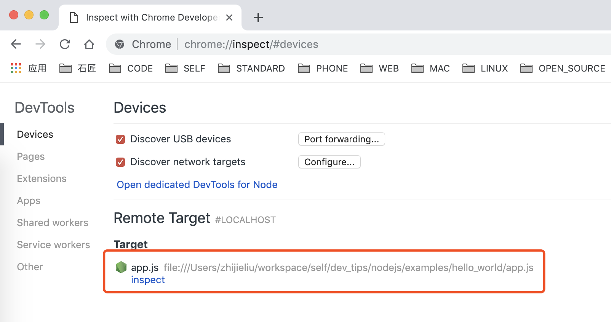
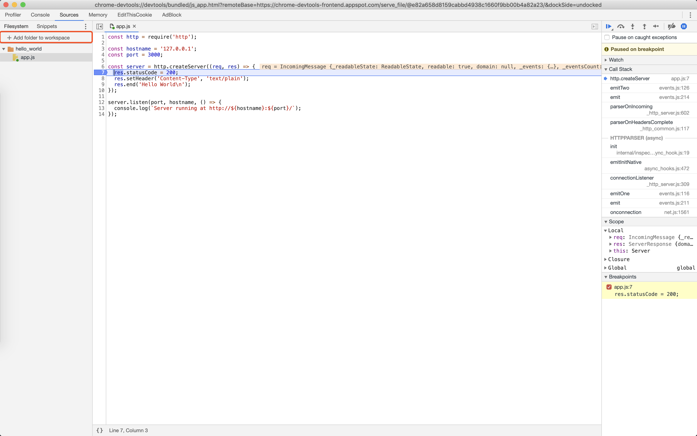

[NODE](https://nodejs.org)
===

## 环境配置

> 建议使用[NVM](https://github.com/creationix/nvm)来管理本机NODE版本 

**NVM常用命令**

```bash

nvm install node #安装最新版本node

nvm install 8.9.0 #安装指定版本node

nvm ls #查看已安装的node版本情况

nvm use 10.15.3 #指定使用某个版本node

```

## Hello World

按编程界的通用准则，摘抄官网的一段Hello World代码

```bash
cd /home/yourname #进入个人主目录
vi app.js #创建demo文件，并写入如下内容
```

```nodejs
const http = require('http');

const hostname = '127.0.0.1';
const port = 3000;

const server = http.createServer((req, res) => {
  res.statusCode = 200;
  res.setHeader('Content-Type', 'text/plain');
  res.end('Hello World\n');
});

server.listen(port, hostname, () => {
  console.log(`Server running at http://${hostname}:${port}/`);
});
```

```bash
node app.js #启动程序
```
然后用浏览器访问 http://localhost:3000 , 就会看到页面显示**Hello World**. 恭喜您成功学会NodeJS

## DEBUG

启动程序的时候使用 **--inspect** 就可以启动debug客户端的服务

默认端口为 **127.0.0.1:9229**

> *--inspect=[host:port]** 可以自定义端口*

**启动示例**

```bash
# start command
node --inspect app.js

# output
Debugger listening on ws://127.0.0.1:9229/0370d241-e5c9-4a5d-918f-bcdfeaf1dbb4
For help see https://nodejs.org/en/docs/inspector
Server running at http://127.0.0.1:3000/
```

* **使用Google Chrome调试**

1. 地址栏输入 *chrome://inspect/#devices*, 看到如下界面

    <br>

    

    > 点击configure可以配置自定义的发现端口

2. 点击[inspect]进入debug窗口
   
   <br>

   

   > 填加源码所在文件夹，即可开始

    <br>

* **使用vscode调试**

    <br>点击左侧工具栏中的DEBUG按钮，增加配置，选择node即可

    <br>示例配置文件

    <br>

    ```json
    {
        "version": "0.2.0",
        "configurations": [
            {
                "type": "node",
                "request": "launch",
                "name": "Launch Program",
                "program": "${workspaceFolder}/nodejs/examples/hello_world/app.js"
            }
        ]
    }
    ```

## 常用WEB服务框架

* [EXPRESS](http://expressjs.com)

<br>
<br>
<br>

**有用的网站**

* [NODE SCHOOL](https://nodeschool.io)
* [NPM](https://www.npmjs.com)